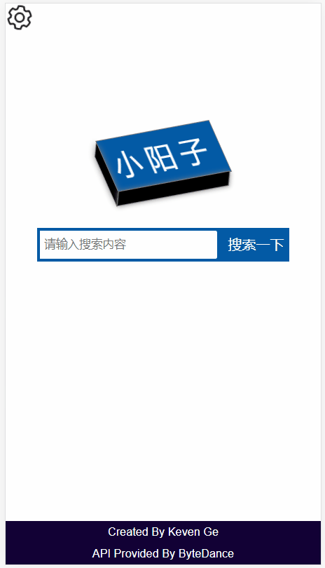
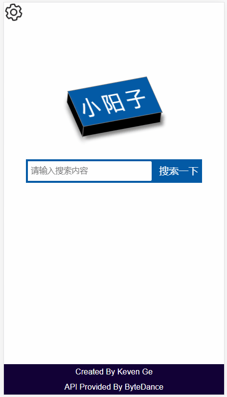
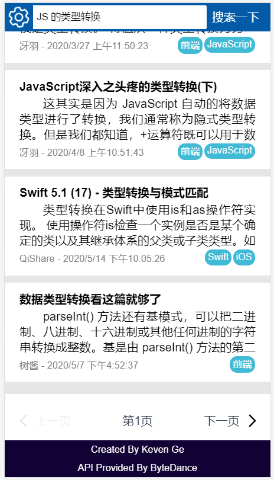

# 字节跳动训练营成果项目

这是来自字节跳动训练营的成果项目

## 介绍以及背景

本项目是字节跳动的【玩转前端】训练营的大作业。

本项目通过使用VUE框架以及AXIOS来完成，并且本项目只包括源代码，不包括部署之后的代码。

如果需要部署之后的node.js代码，请参考[服务器代码](https://github.com/KevenGe/bytedance-toutiao-serve/tree/master);

声明，在本项目中，除去项目中的静态矢量图（齿轮、上翻页、下翻页）之外，所有的内容（包括组件、动画）均为本人代码实现。

在本项目中主要完成的功能：

- 基础功能点
  
  - [ ] 【基础】搜索框，搜索候选
  - [ ] 【基础】搜索结果页（列表页）
  - [ ] 【基础】结果页可以通过swiper滑动进行切换页面（手动js实现）
  - [ ] 【基础】彩蛋功能，对特定的词汇（js，css，html）进行搜索，会显示彩蛋
  - [ ] 【基础】实现node.js的服务（在链接中）

- 新增以及优化功能点

  - [ ] 【新增】增加设置页
  - [ ] 【优化】设置齿轮动画
  - [ ] 【优化】在设置中自己优化的点击按钮以及动画
  - [ ] 【优化】主页搜索页点击动画
  - [ ] 【优化】主图标浮动动画
  - [ ] 【优化】优化本搜索的色盘
  - [ ] 【新增】在搜索页无限制滚动
  - [ ] 【优化】滑动动画进行了优化

 </img>

## 项目运行截图

（如果本部分的GIF查看不了，可以先克隆到本地，然后查看）

默认主页

 </img>

打开或者关闭设置

 </img>

 </img>

搜索栏在主页的动画

 </img>

搜索流程的变化

 </img>

滑动翻页功能

 </img>

点击翻页功能

 </img>

无限滑动

 </img>

彩蛋演示

 </img>

## 安装以及使用

本项目需要提前安装好node.js环境以及git环境，需要满足node.js环境版本大于12。

1 首先需要克隆本项目到本地

```bash
git clone git@github.com:KevenGe/bytedance-toutiao.git
```

2 然后需要在项目内部安装包

```bash
cd bytedance-toutiao

npm install
```

3 如果需要获取打包之后的结果，可以在目录下执行下面的命令

```bash
npm run build

# 或者执行下面的命令
# vue ui
# 1. 选中当前项目
# 2. 然后点击【任务】
# 3. 点击【build】
```

4 如果需要对代码进行开发、二次修改，可以执行下面的命令

```bash
npm run serve

# 或者执行下面的命令
# vue ui
# 1. 选中当前项目
# 2. 然后点击【任务】
# 3. 点击【serve】
```

## 贡献者以及拥有者

- Keven Ge

## License

- GPL 协议
